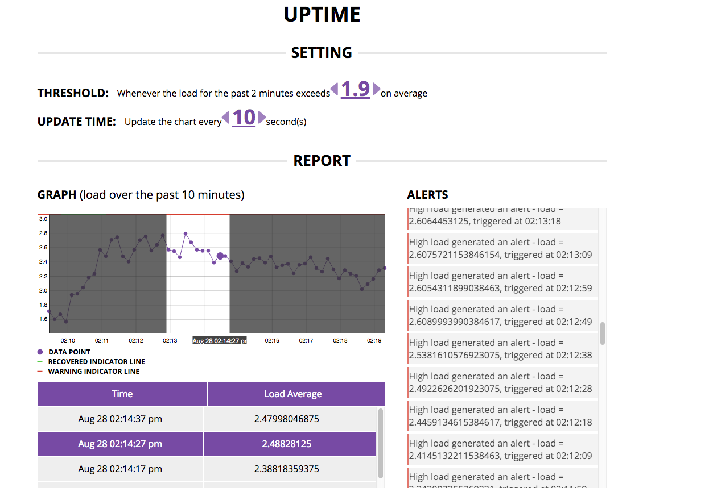

##Uptime
#####by Hao Huang



### Demo
```
git clone -b uptime git@github.com:haohcraft/redux-boilerplate.git uptime
cd uptime
npm install
npm start
```
Then open http://localhost:4000/ to launch the app

### Features
 - A control to change the threshold of the alerting
 - A control to change the time to re-fetch the data
 - A crossfilter graph to display the data
    - hovering highlight
    - a slider to select the time range to filter the data list
    - Warning/Recover indicator shows up when hovering on alert items

### Implementation
#### Backend Part
It uses NodeJS' `os` module to get the last minute's load on average and uses ExpressJS to expose the data out. Within `server/collectLoad.js` I use an fixed size array to store the load measurements.

*Note*: use REST instead of WebSocket due to a long term performance concert [reference](http://blog.arungupta.me/rest-vs-websocket-comparison-benchmarks/)

#### Front End Part
- Use React and D3 for regular and graph related components
- Use Redux to orchestra different parts of *smart* components within `scripts/containers`
- Use the decorator pattern to make the target component "dragable" so that I don't have to use `jQuery` or `window.addEventListener` to pasively reat to `mousedown` and `mousemove` events when users are dragging the slider. Also another benefit is that I can attach the onMouseMove listeners as close as possible to the target component.
- Use a middleware to handle async calls


### Improvement

#### Front End
1. UX
    - [ ] make the time range selection experience more feasible. Right now, the mouseDown and mouseMove movement is not visible
    - [ ] add left/right handlers for the time range selector
    - [ ] make a notifier for the newly coming alerts when the user has scrolled down the list to view the history


#### Backend
1. Scale up, to handle multiple users' monitoring
    - [ ] add the logic to store/specify individule user's settings
    
2. More control for the client side
    - [ ] add an API point for the client to adjust the period of monitoring, instead of just for the last ten minutes.
    - [ ] add an API poin to the client to stop the monitoring behavior

#### Code
- [ ] the `middlewares/async.js` is a little bit tight to current API point, can make it more abstract